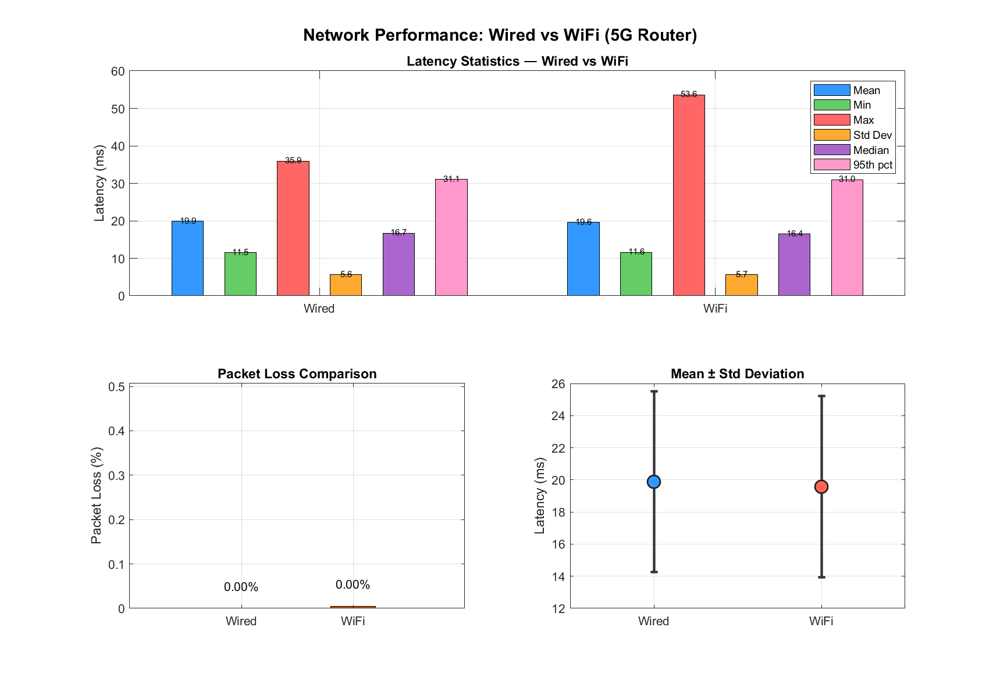

# Traffic Intersection Simulation over a Real Network (toward 5G V2X testing)

An extension of my [Traffic_Intersection_Simulation](https://github.com/Phearamony/Traffic_Intersection_Simulation)
master's research at **Gunma University (Kamal Laboratory)**. The aim is to move the right-turn
coordination system out of an ideal, zero-latency simulation and **test it over real communication links**,
ultimately the Magna Wireless 5G network.

📄 The method itself is described in the paper
[Learning-Based Optimal Right-Turn Coordination System for Connected and Automated Vehicles at Intersections](https://github.com/Phearamony/Traffic_Intersection_Simulation/blob/main/paper/Phan_SICE2026_Right-Turn_Coordination.pdf)
(SICE Festival 2026, Yokohama).



---

## What this repo adds

The original simulation assumes perfect V2X communication, with no packet loss and no latency. Here, every
simulated vehicle actually sends its state over the network:

```
PC 2 (MATLAB, vehicles)                       PC 1 (Python, RSU)
┌──────────────────────┐   UDP: ID, x, y,     ┌──────────────────────┐
│ intersection sim     │ ──── v, direction ─▶ │ rsu_listener.py      │
│ (MPC / IDM vehicles) │ ◀─── echo ────────── │ (echo server)        │
└──────────────────────┘                      └──────────────────────┘
        └─ round-trip time and packet loss are logged for every message
```

* Every car sends one message per simulation step (`dt = 0.5 s`) over UDP.
* The RSU side echoes it back, and MATLAB records the round-trip latency. A reply that does not arrive
  within 0.3 s counts as a lost packet.
* Results are saved per link type (`results_wired.mat`, `results_wifi.mat`) and compared.

## Results so far: wired vs. Wi-Fi

| Metric | Wired | Wi-Fi |
|---|---|---|
| Packets sent | 18,914 | 22,482 |
| Packets lost | 0 | 1 |
| Mean latency | 19.88 ms | 19.57 ms |
| Median latency | 16.74 ms | 16.45 ms |
| 95th percentile | 31.09 ms | 30.96 ms |
| Max latency | 35.93 ms | 53.59 ms |

Both links stay well within the 0.5 s control step. Next steps are running the same test over 5G and
feeding the measured latency and loss back into the RSU coordination loop.

## Repository structure

```
class/      Car.m (IDM / QP-MPC vehicle), RSU.m and variants
function/   IDM and trajectory / acceleration plotting
main/       main_v2v_mpc_rsu.m (networked simulation), comprison.m (wired vs Wi-Fi analysis), results
output/     Trajectory figures from networked runs
simplot/    Intersection drawing and initial values
```

## How to run

Requirements: MATLAB (with `udpport`, Instrument Control Toolbox) on the vehicle PC, and Python 3 on the
RSU PC.

1. **PC 1 (RSU):** run the UDP echo listener `rsu_listener.py` on port `5005`. This script is not in the
   repo yet.
2. **PC 2 (vehicles):** set `RSU_IP` in `main/main_v2v_mpc_rsu.m` to PC 1's IP address and fix the
   `addpath` lines for your clone location.
3. Connect over Ethernet, run `main_v2v_mpc_rsu.m`, and save the results as `wired`.
4. Switch to Wi-Fi (or 5G), run it again, and save the results as `wifi`.
5. Run `main/comprison.m` to produce the comparison figures and `network_summary.csv`.
